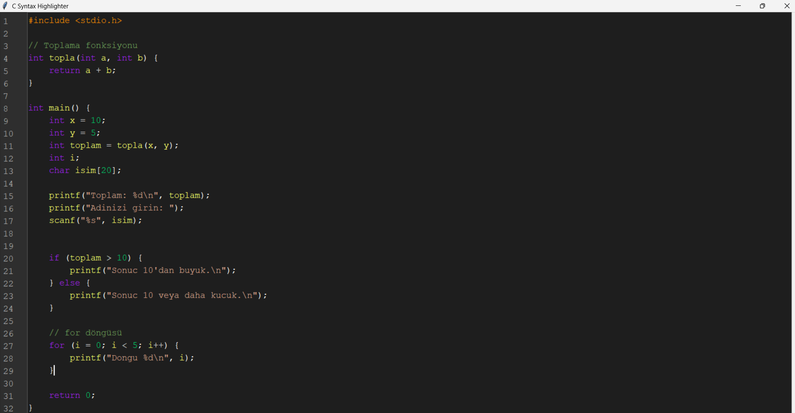
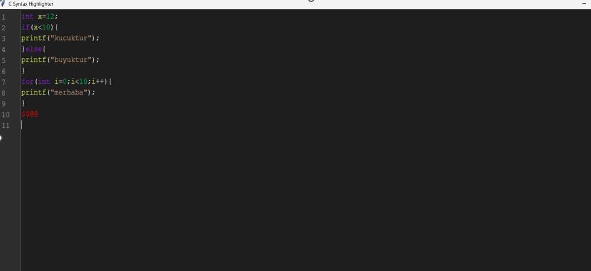

# 🧠 Gerçek Zamanlı Gramer Tabanlı Sözdizimi Vurgulayıcı ve GUI

Bu proje, C programlama diline yönelik gerçek zamanlı bir sözdizimi vurgulayıcı (syntax highlighter) ve kullanıcı dostu bir grafiksel arayüz (GUI) sunar. Python ve Tkinter kullanılarak tamamen manuel geliştirilen bu uygulama, kod yazımını hem görsel hem de dilbilgisel olarak destekler. Yazılım geliştiriciler ve öğrenciler için faydalı ve öğretici bir araçtır.

---

## 🎯 Proje Amacı

Kod yazarken anında geri bildirim sağlayarak hataları erken fark etmeyi ve öğrenme sürecini kolaylaştırmayı hedefler. Proje, dört temel bileşene dayanır:

- 🧩 Sözcük düzeyi analiz
- 🔍 Sözdizimi kontrolü
- 🎨 Vurgulama sistemi
- 🪟 Kullanıcı arayüzü (GUI)

Aynı zamanda eğitimde algoritmik düşünme becerilerinin geliştirilmesine katkı sağlar.

---

## 🔧 Proje Detayları

### 1. Dil ve Gramer Yapısı

Uygulama, **C programlama dilinin temel yapılarını** analiz ederek sözdizimi vurgulama ve doğrulama işlemlerini gerçekleştirir.  
Analiz edilen temel unsurlar şunlardır:

---
### 🧩 Anahtar Kelimeler

C dilinde tanımlı temel kontrol ve veri tipi anahtar kelimeleri tanınır:

- **Değişken tanımları:** `int`, `float`, `char`, `double`
- **Kontrol yapıları:** `if`, `else`, `for`, `while`, `do`, `return`, `switch`, `case`, `break`, `continue`
- **Diğer:** `void`, `static`, `const`, `typedef`, `struct`, `union`, `enum`, `extern`, `goto`, `sizeof`

> Bu anahtar kelimeler renklendirilir, bazıları gramer açısından da doğrulanır (örneğin `if`, `for`, `return`).

---

### 📚 Fonksiyonlar

Standart C kütüphane fonksiyonları ve kullanıcı tanımlı fonksiyonlar desteklenir:

- **Giriş/Çıkış:** `printf`, `scanf`, `puts`, `getchar`, `putchar`
- **Program giriş noktası:** `main`


---

### ➕ Operatörler

Aritmetik, ilişkisel, mantıksal ve atama operatörleri renklendirilir:

- **Aritmetik:** `+`, `-`, `*`, `/`, `%`
- **İlişkisel:** `==`, `!=`, `>`, `<`, `>=`, `<=`
- **Mantıksal:** `&&`, `||`, `!`
- **Atama:** `=`, `+=`, `-=`

---

#### 🧱 Semboller ve Yapılar

C diline özgü yapısal unsurlar doğru bir şekilde ayrıştırılır:

- **Parantezler:** `()`, `{}`, `[]`  
- **Noktalı virgül:** `;`  
- **Yorum satırları:** `//`, `/* */`
#### 📐 Gramer Kuralları

Uygulamada kullanılan gramer kuralları, **ifade temelli (statement-oriented)** bir yapıya sahiptir.

🛠️ Uygulama Python + Tkinter ile geliştirilmiştir.

### 📷 Görsel 1 – Örnek Kod Analizi  



### 2. Teknik Altyapı

#### 🔹 Sözcük Analizi

- `tokenize()` fonksiyonu, regex ile parçalama yapar.  
Örnek: `int x = 10;` → `int (keyword)`, `x (identifier)`, `= (operator)`
#### 🔹 Sözdizimi Kontrolü

**Yöntem:**  
C programlama diline özgü gramer kurallarını doğrulamak için **recursive descent parser** (özyinelemeli iniş ayrıştırıcısı) kullanılır.  
Bu yöntem, `if`, `for`, `while` gibi yapılarla birlikte değişken tanımlamaları ve fonksiyon çağrılarını **hiyerarşik bir şekilde analiz eder**.

**İşleyiş:**  
Kod, sözdizimsel olarak doğru ifadeler için taranır. Geçerli yapılar, `valid_syntax` fonksiyonu tarafından onaylanır ve kullanıcı arayüzünde **yeşil renkle** (`#00ff00`) görsel olarak işaretlenir.  
Bu, kullanıcıya kodun doğruluğunu **anında bildirir.**

---

**Avantajlar:**

- ⚡ Gerçek zamanlı analiz, kod yazımı sırasında hızlı geri bildirim sağlar.  
- 🔄 Karmaşık ifadeler (örneğin iç içe geçmiş döngüler veya koşullar) doğru şekilde çözümlenir.  
- 🚀 Performans optimizasyonu sayesinde, büyük kod bloklarında bile akıcı bir deneyim sunar.


### 📷 Görsel 2 – Geçersiz İfade Vurgulama  

.

### 3. Kullanıcı Arayüzü (GUI)

Tkinter ile geliştirilen grafiksel arayüz, kullanıcı odaklı bir deneyim sunar:

---

#### 🖊️ Kod Yazma Alanı

- Yazı tipi: **Courier New**, 13pt  
- Tema: **Koyu tema** (okunabilirlik için optimize edilmiş)  
- Gerçek zamanlı vurgulama: Her tuş vuruşunda (`<KeyRelease>` eventi) analiz ve renklendirme yapılır.

---

#### 🔢 Satır Numaraları

- Gri arka planlı satır numaraları, kodun okunabilirliğini artırır.  
- Kod alanıyla senkronize çalışır.

---

#### ↕️ Kaydırma Çubuğu

- Uzun kodlarda kolay gezinme sağlar.  
- Satır numaraları ve kod alanıyla tam uyumludur.

---

#### 👨‍💻 Kullanıcı Deneyimi

- Sezgisel tasarım, hem yeni başlayanlar hem de deneyimli geliştiriciler için uygundur.  
- Hızlı tepki süresi ile akıcı bir yazma deneyimi sunar.


### 📷 Görsel 3 – Kullanıcı Arayüzü  

Açıklama: Şekil 3 – Kullanıcı dostu grafik arayüz.

## 💻 Gereksinimler

- Python 3.x  
- Tkinter (Python ile birlikte gelir)

---

## ⚙️ Kurulum

1. Projeyi klonlayın:
   ```bash
   https://github.com/fatihcengiz/syntax-highlighter

2. Dizinine gidin:
   ```bash
   cd syntax-highlighter


3. Uygulamayı çalıştırın:
   ```bash
   python main.py


## 📹 Tanıtım Videosu

🎬 [Proje Tanıtım Videosu (YouTube)](https://www.youtube.com/watch?v=kj4glbgZY0Y)

---

## 📝 Medium Yazısı

📄 [Gerçek Zamanlı Sözdizimi Vurgulayıcı ile Kodlama Deneyimini Geliştirmek](https://medium.com/@goralfatih2/ger%C3%A7ek-zamanl%C4%B1-s%C3%B6zdizimi-vurgulay%C4%B1c%C4%B1-ile-kodlama-deneyimini-geli%C5%9Ftirmek-49d7705ad1f4)

---
## 📄 Proje Raporu (PDF)

📥 [Raporu buradan görüntüle](./rapor.pdf)


