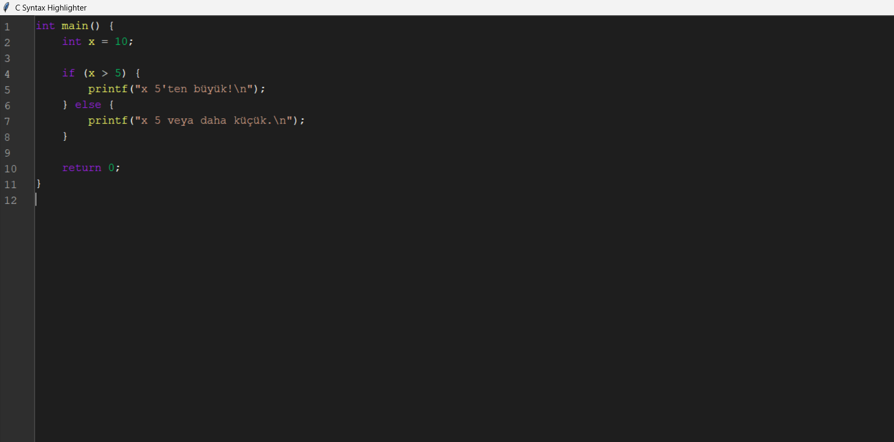

# 🧠 Gerçek Zamanlı Gramer Tabanlı Sözdizimi Vurgulayıcı ve GUI

Bu proje, C programlama diline yönelik gerçek zamanlı bir sözdizimi vurgulayıcı (syntax highlighter) ve kullanıcı dostu bir grafiksel arayüz (GUI) sunar. Python ve Tkinter kullanılarak tamamen manuel geliştirilen bu uygulama, kod yazımını hem görsel hem de dilbilgisel olarak destekler. Yazılım geliştiriciler ve öğrenciler için faydalı ve öğretici bir araçtır.

---

## 🎯 Proje Amacı

Kod yazarken anında geri bildirim sağlayarak hataları erken fark etmeyi ve öğrenme sürecini kolaylaştırmayı hedefler. Proje, dört temel bileşene dayanır:

- 🧩 Sözcük düzeyi analiz
- 🔍 Sözdizimi kontrolü
- 🎨 Vurgulama sistemi
- 🪟 Kullanıcı arayüzü (GUI)

Aynı zamanda eğitimde algoritmik düşünme becerilerinin geliştirilmesine katkı sağlar.

---

## 🔧 Proje Detayları

### 1. Dil ve Gramer Yapısı

C dilinin temel yapıları analiz edilir:

- Anahtar kelimeler: `int`, `if`, `else`
- Fonksiyonlar: `printf`
- Operatörler: `+`, `=`, `>=`

Gramer kuralları, ifade (statement) odaklıdır:  
Örneğin: `Statement → if (Expression) BlockOrStatement`

🛠️ Uygulama Python + Tkinter ile geliştirilmiştir.

### 📷 Görsel 1 – Örnek Kod Analizi  

**Tür:** C kod örneği ekran görüntüsü  
**Açıklama:** Şekil 1 – Analiz edilen örnek C kodu.  
`int x = 10; if (x > 5) { printf("Geçti\n"); }`

---

### 2. Teknik Altyapı

#### 🔹 Sözcük Analizi

- `tokenize()` fonksiyonu, regex ile parçalama yapar.  
Örnek: `int x = 10;` → `int (keyword)`, `x (identifier)`, `= (operator)`

#### 🔹 Sözdizimi Kontrolü

- Recursive descent parser ile C diline özgü gramer kontrolü yapılır.
- Geçerli yapılar `valid_syntax` ile yeşil renkte işaretlenir.

#### 🔹 Hatalı/Geçersiz İfade Algılama

- Tanımsız, geçersiz veya gramer dışı bir ifade girildiğinde örneğin:
  ```c
  $$ x = 5;
  #a = 9;
u ifadeler geçersiz kabul edilir ve kırmızı renkle (#ff0000) vurgulanır.

Kullanıcı, hatalı yazımı anında fark eder.

### 📷 Görsel 2 – Geçersiz İfade Vurgulama  

Açıklama: Şekil 2 – $, # gibi tanımsız sembollerin kırmızı renkle işaretlenmesi.

3. Kullanıcı Arayüzü (GUI)
Tkinter ile geliştirilen kullanıcı arayüzü şunları içerir:

Kod yazma alanı (Courier New, 13pt, koyu tema)

Gri arka planlı satır numaraları

Kaydırma çubuğu ile senkronize gezinme

<KeyRelease> eventi ile her tuş vuruşunda analiz ve renklendirme

### 📷 Görsel 3 – Kullanıcı Arayüzü  

Açıklama: Şekil 3 – Kullanıcı dostu grafik arayüz.

💻 Gereksinimler
Python 3.x

Tkinter (Python ile birlikte gelir)

⚙️ Kurulum
Projeyi klonlayın:
git clone https://github.com/kullaniciadi/projeadi.git
Dizinine gidin:
cd projeadi
Uygulamayı çalıştırın:
python main.py
 Kullanım
Uygulamayı açın ve C dili kodu yazmaya başlayın.

Örnek:

c
Kopyala
Düzenle
int x = 80;
if (x >= 50) {
    printf("Geçti\n");
}
Her yapı renklendirilir.

Satır numaraları ve kaydırma çubuğu ile kolayca gezinilir.
📹 Tanıtım Videosu
🎬 Proje Tanıtım Videosu (YouTube)

📝 Medium Yazısı
📄 Sözdizimi Vurgulayıcı Geliştirme Süreci
## 📄 Proje Raporu (PDF)

📥 [Raporu buradan görüntüle](./RAPOR.pdf)
